## Amazon Transcribe Comprehend Podcast

A demo application that transcribes and indexes podcast episodes so the listeners can explore and discover episodes of interest and podcast owners can do analytics on the content over time. This solution leverages Amazon Transcribe, Amazon Comprehend, Amazon Elasticsearch, AWS Step Functions and AWS Lambda.

### High-level Architecture

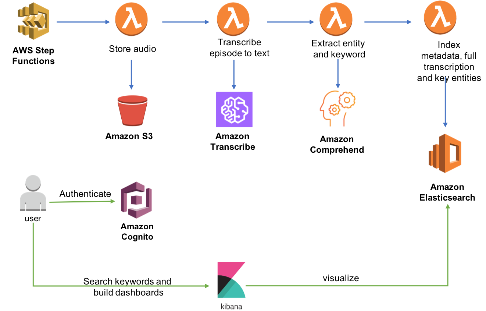

## Running the Example

1. Launch the CloudFormation template

	Region| Region Code | Launch
	------|------|-------
	US East (Virginia)| <span style="font-family:'Courier';">us-east-1</span> | [](https://console.aws.amazon.com/cloudformation/home?region=us-east-1#/stacks/new?stackName=podcast-transcribe-index&templateURL=https://s3.amazonaws.com/aws-machine-learning-blog/artifacts/discovering-podcasts/packaged.yaml)

	* Click **Create Change Set** to create the change set for this transform

		* **Stack Name**: Provide a unique stack name for this account.
		
		* **AudioOffset**: The number of seconds before the keyword to link to on the audio file. The default is 1 second.
		
		* **kibanaUser**: The username of the user that is used to log into kibana, Defaults to `kibana`.
		
		* Acknowledge the stack may create IAM resources by checking these boxed:
		
			**I acknowledge that AWS CloudFormation might create IAM resources.**
			
			**I acknowledge that AWS CloudFormation might create IAM resources with custom names.**
		
	* Click **Create Change Set** to create the change set for this transform


1. Wait for CloudFormation stack to complete creation. It takes about 15-20 minutes to create the stack, mostly due to the time required to create and configure an Amazon Elasticsearch cluster.

1. Navigate to the **RSS Step Functions State Machine** by going to the **Output** section of the CloudFormation stack, and click on the `RssStateMachineUrl`

1. In the Step Functions console, create an execution using the **Start Execution** button and provide the input payload like below:

	```json
	{
	  "PodcastName": "AWS Podcast",
	  "rss": "https://d3gih7jbfe3jlq.cloudfront.net/aws-podcast.rss",
	  "maxEpisodesToProcess": 10,
	  "dryrun": "FALSE"
	}
	```

	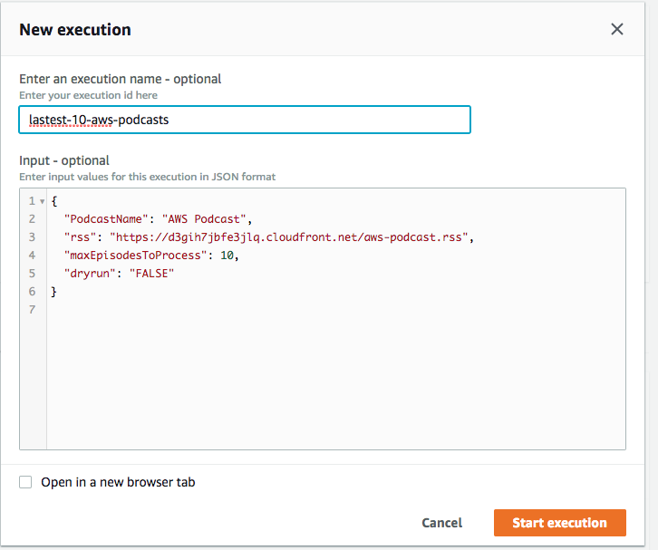

	> Note: You can choose a different podcast feed by changing the rss  input parameter.
	> 
	> The `maxEpisodesToProcess` input parameter lets you control the number of episodes to process from this feed. This helps keep down the cost of this demo. For reference, Amazon Transcribe costs $0.0004/second, which comes to $0.36 for a 15 minute audio. 
	> 
	> 	The `dryrun` flag will test the state machine without calling the AI functions. Leave is to FALSE to fully process the podcast.

1. Wait for workflow execution to complete. Amazon Transcribe can take about 10-15 minutes to process the 10 episodes (note that there's a default soft limit of 10 concurrent jobs that may be increased per request). Note that you will be able to see results appear in the ElasticSearch index as soon as some executions of the child workflow **EpisodeStateMachine** completes, even while the parent **RssStateMachine** is still waiting on the rest of the epsidoes to finish. 

### Search and query the episode index in Kibana 

Once the processing of episodes completes, you can search and visualize the results in Kibana

1. Find the Url for Kibana in the CloudFormation Output section and log in to Kibana, use the username and password (also from the CloudFormation Output). You will be required to enter in a new password on the initial login.

1. Once Kibana Opens, you need to set up indices for searching. Click **Set up index patterns**

	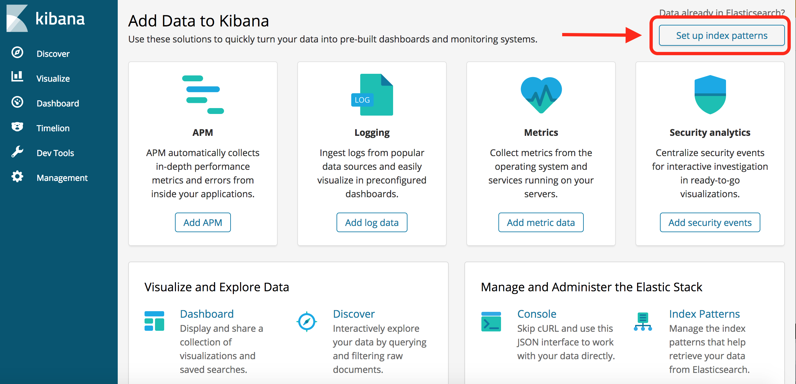

1. In the index pattern textbox, type `episodes`, then click **Next Step**:

	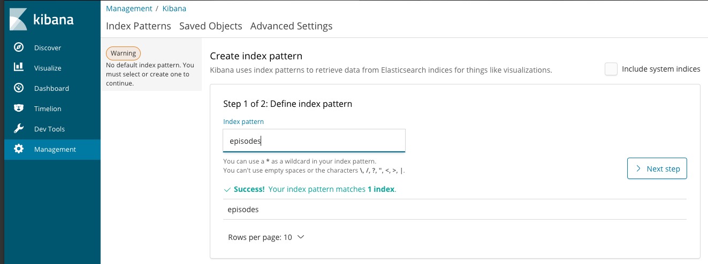

1. In the second step, if you are asked to pick a Time Filter Field, choose “I don’t want to use the Time Filter”, then choose **Create Index Pattern**.

1. Click the **Discover** entry on the left-hand toolbar. 

1. Type in search terms you are interested in, and you can explore the episodes that mentions it and read on the transcript of the episode! In the example below, I used the query `nlp OR "natural language processing"` to search for episodes that mention either the word “nlp” or the phrase “natural language processing”. 

	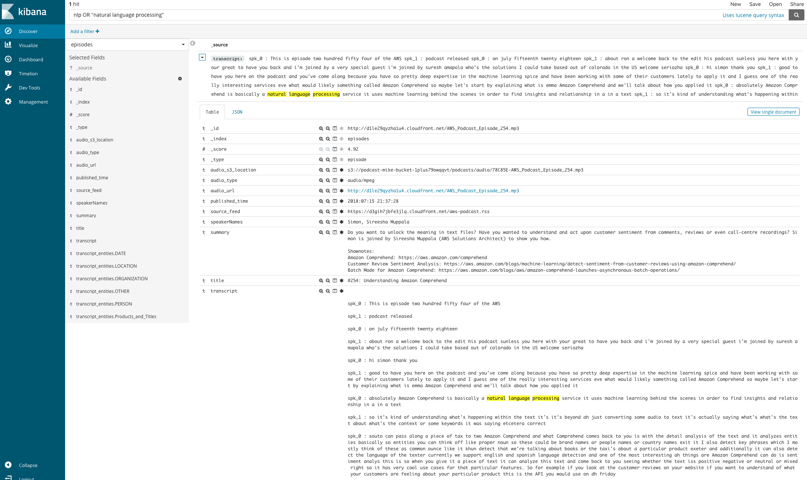


	If you scroll pass the transcript, you will also see some of the named entities extracted from the transcript. We can later use these keywords to build some visualization/tag clouds: 

	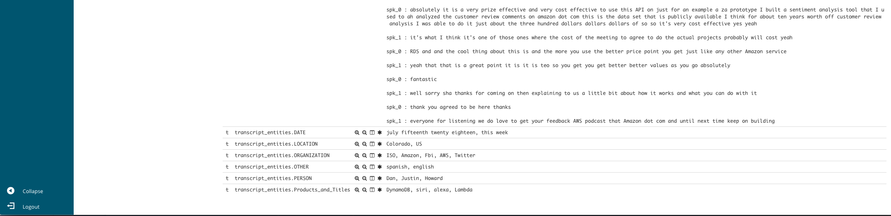

### Search and query the paragraph index in Kibana 

The second index we built lets you search at a paragraph level where a keyword appears in, and links you to the exact spot in the audio where it was discussed. 

1. Navigate to “**Management**” → **Index Patterns** →  **Create Index**
1. In the index pattern textbox, type **paragraphs**, then click **Next Step**
1. Accept the defaults and click **Create Index Pattern**:
1. Scroll Down to the **Url** field and click the edit icon to the right.
1. Set the Format to Url, and the type to ‘Link’, And click **Update Field**

	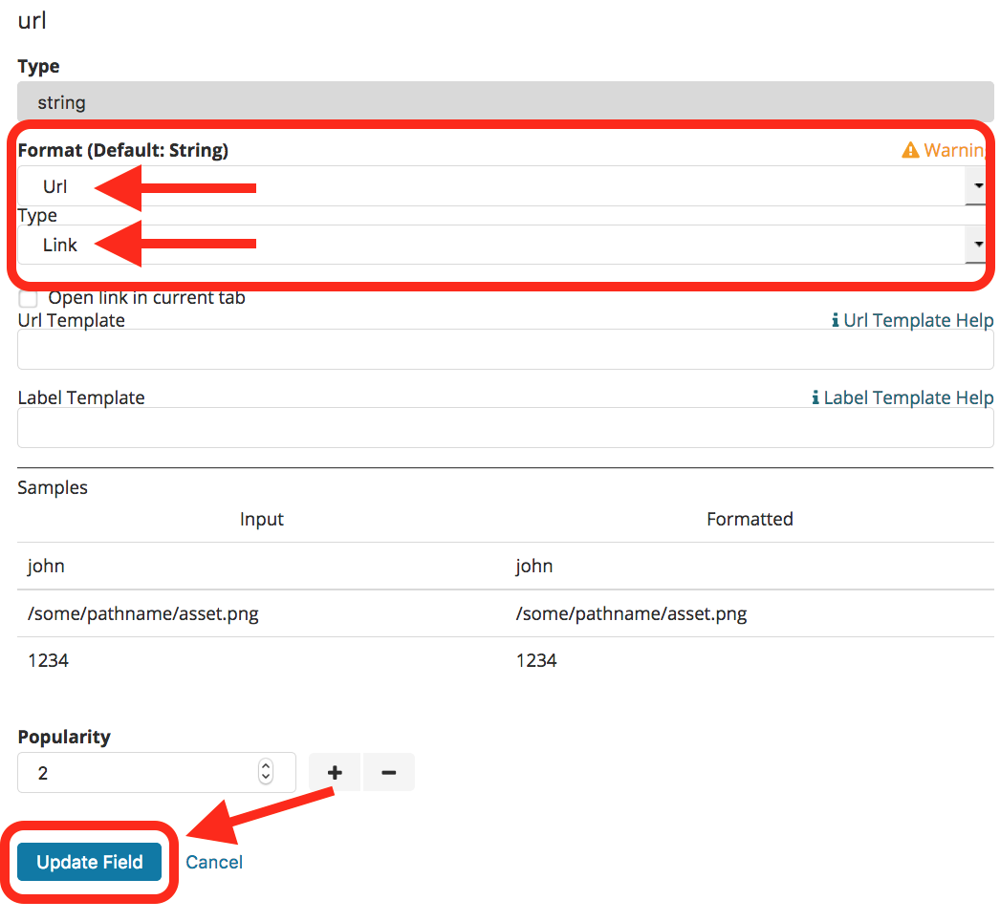

1. In the ’Discover' section, ensure you have picked the paragraph index. 

	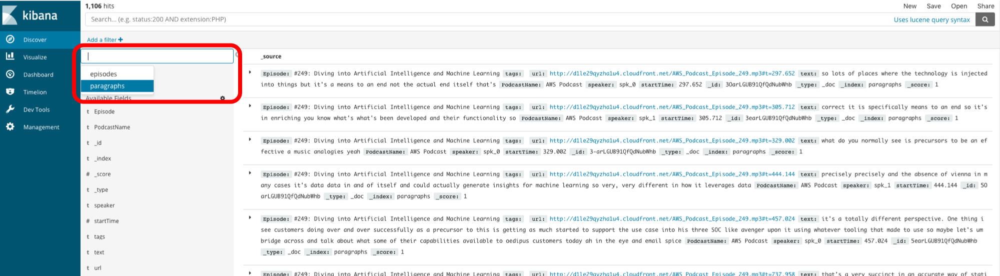

1. Now customize the search columns by adding the PodcastName. Repeat this for `Episode`, `speaker`, `text`, and `url`.

	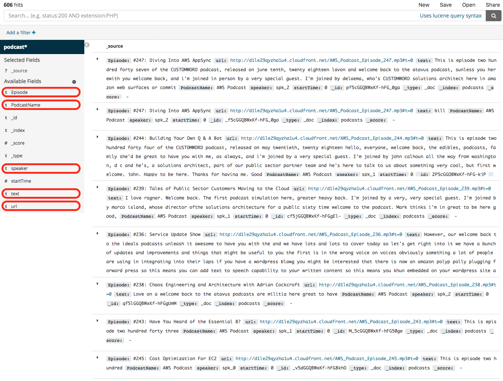

	You have a screen that looks like this:

	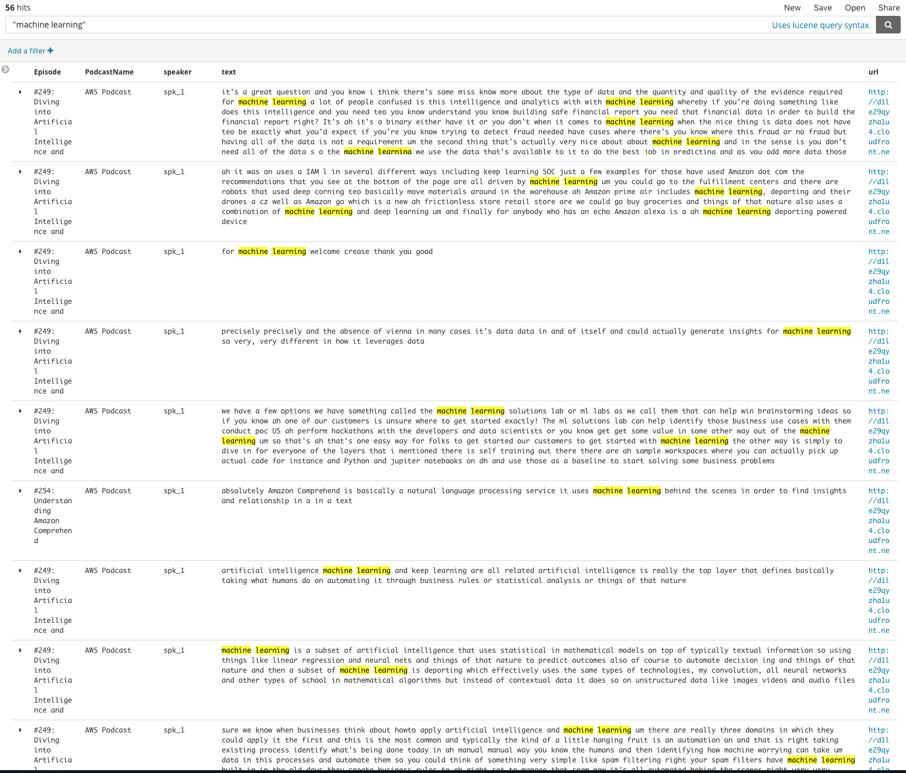


### View dashboards in Kibana 

Now for some fun visualizations! 

1. Download the Kibana Dashboard file [here](https://angelaw-workshop.s3.amazonaws.com/kibana.json)

1. On the Kibana home page, click **Management** on the left side toolbar.

	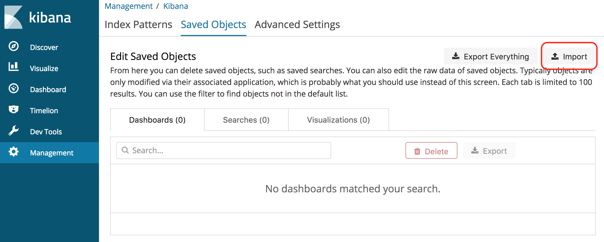

1. On the management page, click **Import** and select kibana.json downloaded from above. 
You need to map the visualization objects to the indices in your Kibana application like shown below. Confirm **Yes, overwrite all objects** when the pop-up appears. 

	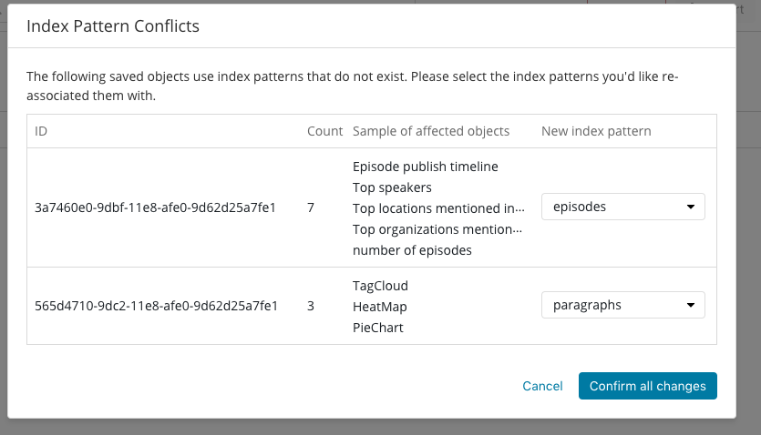

1. You can now find the imported dashboard under **Dashboard** →  **Podcast analytics**

	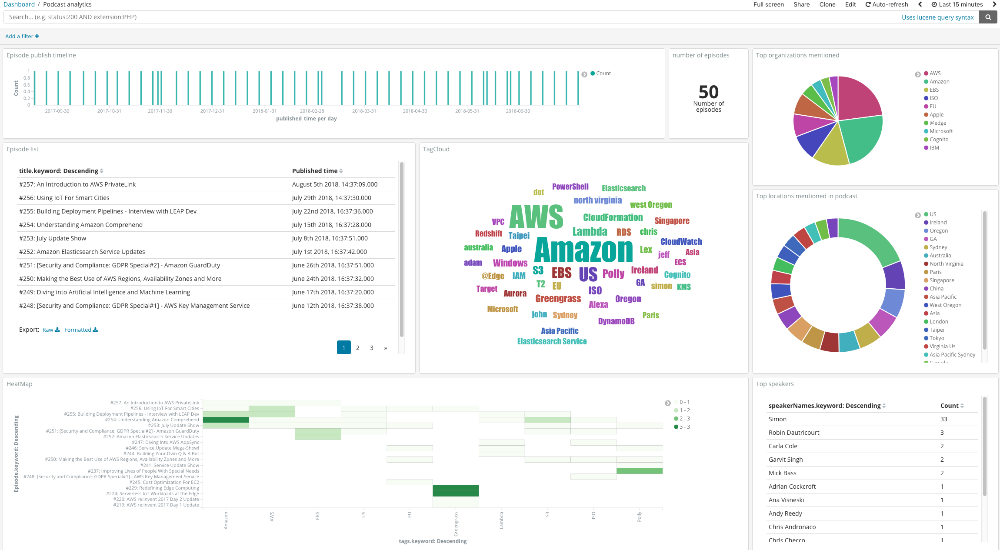

1. You can do analysis using the dashboard by leveraging the search functionality. For example, by putting the search term “machine learning”, we update the analytics by visualizing only episodes that contains the phrase “machine learning”

	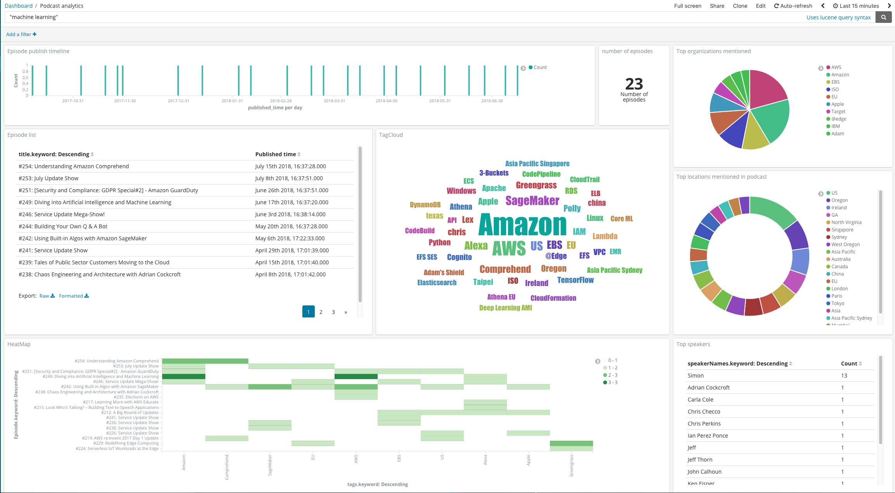


## CloudFormation template resources

* **Amazon Elasticsearch Cluster**: This will provide the persistence and visualization tools for our podcast index. Visualization is performed by Kibana, which is included as part of the Elasticsearch Service.

* **Amazon Cognito User Pool**: User directory used by Kibana to authenticate users.  

* **RSS Feed Step Function State Machine**: A workflow that processes an RSS feed. This will trigger lambda functions that iterates through the episodes in the RSS feed and will create a child state machine to process each episode.
  
  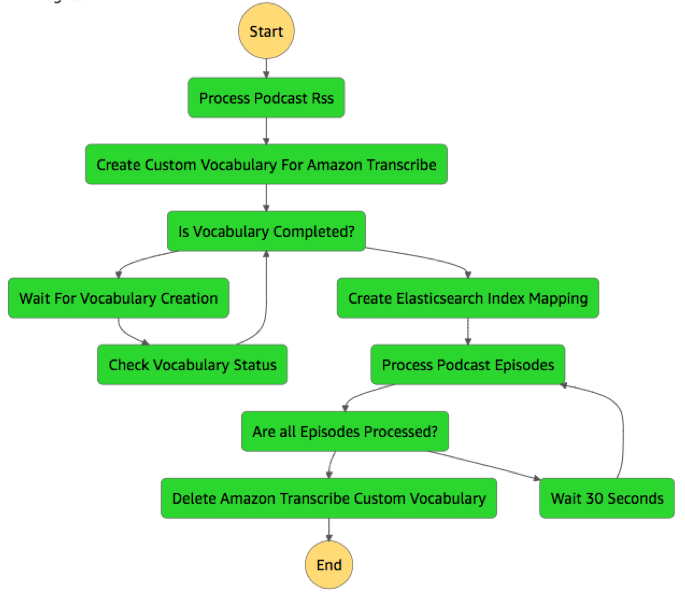
    
* **Episode Step Functions State Machine**: The workflow that processes each individual podcast episode. The extracted transcription and metadata will be indexed into the Elasticsearch cluster.

  


### Lambda functions

#### RSS Feed Step Function State Machine Lambda functions
 
* **processPodcastRss**: Downloads the RSS file and parses it to determine the episodes to download. This function also leverages Amazon Comprehend's [**entity extraction**](https://docs.aws.amazon.com/comprehend/latest/dg/how-entities.html) feature for 2 use cases:

	* To compute an estimate of the number of speakers in each episode. We do this by using Amazon Comprehend to find people's names in each episode's abstract. We find that many podcast hosts like to mention their guest speakers’ names in the abstract. This helps us later when we use Amazon Transcribe to break out the transcription into multiple speakers. If no names are found in the abstract, we will assume the episode has a single speaker. 

	* To build a domain-specific custom vocabulary list. If a podcast is about AWS, you will hear lots of expressions unique to the specific domain (e.g., EC2, S3) that are completely different from expressions found in a podcast about astronomy (e.g., Milky Way, Hubble). Providing a custom vocabulary list to Amazon Transcribe can help guide the service in identifying an audio segment that sounds like “easy too” to its actual meaning “EC2.” In this blog post, we automatically generate the custom vocabulary list by using the named entities extracted from episode abstracts to make Amazon Transcribe more domain aware. Keep in mind that this approach may not cover all jargon that could appear in the transcripts. To get more accurate transcriptions, you can complement this approach by drafting a list of common domain-specific terms so that you can construct a custom vocabulary list for Amazon Transcribe. 


* **createTranscribeVocabulary**: Creates a [**custom vocabulary**](https://docs.aws.amazon.com/transcribe/latest/dg/how-it-works.html#how-vocabulary) for the Amazon Transcribe jobs so it will better understand when an AWS/tech jargon is mentioned. The custom vocabulary is created using the method mentioned above. 
* **monitorTranscribeVocabulary**: Polls Amazon Transcribe to determine if the custom vocabulary creation has completed.
* **createElasticsearchIndex**: Creates [**index mappings**](https://www.elastic.co/guide/en/elasticsearch/reference/current/mapping.html) in ElasticSearch
* **processPodcastItem**: Creates a child state machine execution for each episode while maintaining a maximum of 10 concurrent child processes. This function keeps track of how many processes are active and throttles the downstream calls once the maximum is hit. Amazon S3 is used to store additional state about each episode. 
* **deleteTranscribeVocabulary**: Cleans up the custom vocabulary after the processing of all episodes is complete. Note that we added this step to minimize artifacts that stay around in your account after you run the demo application. However, when you build your own apps with Amazon Transcribe, you should consider keeping the custom vocabulary around for future processing jobs.

#### Episode Step Function State Machine Lambda functions

* **downloadPodcast**: Downloads the podcast from the publisher and stages it in S3 for further processing.
* **podcastTranscribe**: Makes the call to Amazon Transcribe to create the transcription job. Notice how we pass in parameters extracted from previous steps, such as the custom vocabulary to use and number of speakers for the episode. 
* **checkTranscript**: Polls the transcription job for status. Returns the status and the step function will retry of the job is in progress.
* **processTranscriptionParagraph**: This is the most complicated function in the application. You extract the transcription data from transcribe and break it out into paragraphs. The paragraphs are broken by speaker, punctuation, or a maximum length. The output of this function is a file that contains all the paragraphs in the transcription job as well as the start time of when the phrases was spoken in the audio file and the speaker the paragraph is attributed to.
* **processTranscriptionFullText**: This function contains similar logic to **processTranscriptionParagraph**, but the output is a full text transcription in a readable format. 
* **UploadToElasticsearch**: Parses the output of the previous steps and performs a bulk load of the indexes into the Elasticsearch cluster. The connection to Elasticsearch uses a SigV4 signature to perform IAM based authentication into the cluster.


## License Summary

This sample code is made available under a modified MIT license. See the LICENSE file.